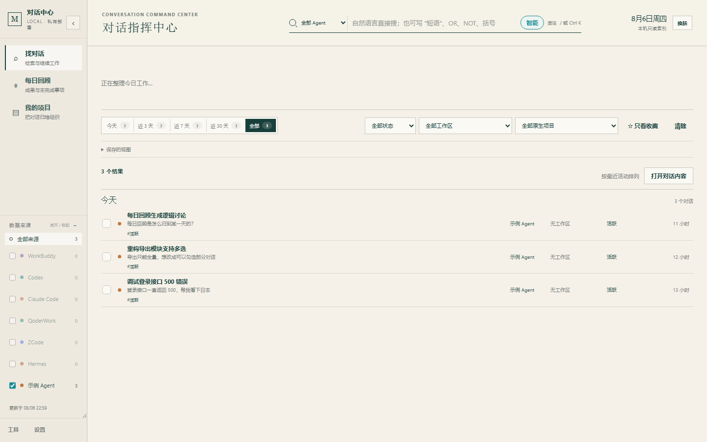
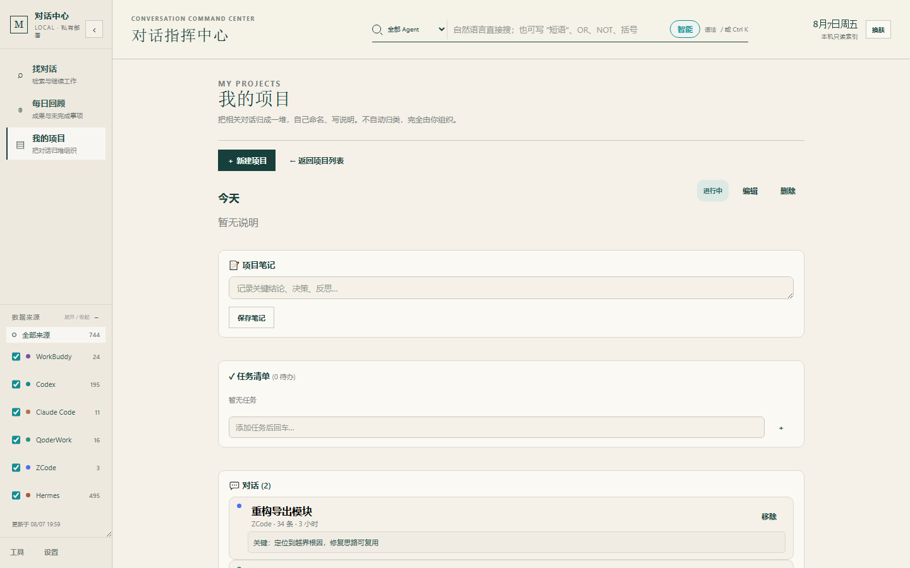

# AI Conversation Hub · Lite

**中文** | [English](README.md)

> 跨 AI 编程助手的极速本地对话切换台：搜索、定位、继续工作。
> 本地运行、零第三方依赖、对原始数据只读。

## 这是什么

如果你同时使用多个 AI 编程助手，对话会散落在各家——“之前在哪聊过这个”“那条任务怎么继续”都很难回答。Hub 的主路径只有三步：**搜索 → 选中 → 继续工作**。

- **找对话**：在所有 agent 的对话里做布尔全文检索（AND/OR/NOT/短语/括号，支持中英文连写如「调试API」）
- **继续工作**：Codex、WorkBuddy 可精确回到原会话；Claude Code 可复制精确恢复命令；ZCode 安全打开原工作区；所有来源都能生成可追溯的跨 Agent 接续包
- **回顾单条对话**：在详情页生成本地回顾卡，提取目标、完成项、决定、未完成、阻塞、提交与文件，并保留 transcript 行号、事件 ID 和内容哈希
- **每日回顾**：事实化的当天回顾——概览统计、按工作区分组的项目进展、你自己的状态标记（离线生成，不调模型）——让你每天结束时清楚今天到底完成了什么
- **整理项目**：把相关对话勾选归入自命名项目，集中管理状态、笔记与任务清单——让做过的事变成可以回看的东西

> 它不是另一个聊天客户端，也不负责替 agent 发消息；它是 Windows 优先、离线可用的跨 harness 对话切换台。

### 速度目标

- 页面监听不等待全量索引：UI 先出现，索引在后台完成
- 真实 757 条本机会话基准（Windows / Python 3.13）：监听从旧版约 **1.97 s** 降到 **0.45 s**，首次列表约 **23 ms**
- 会话详情采用有界 LRU 缓存，重复打开不再反复解析同一 JSONL

## 界面预览


| 找对话 | 每日回顾 | 我的项目 |
|---|---|---|
|  |  |  |

## 关于这个项目

之所以做它，是因为我自己同时用好几个 AI 编程助手，经常想不起"之前在哪聊过这个问题"，翻遍各个客户端也找不到。既然这些助手帮我写了那么多代码，那也请它们帮我解决这个麻烦吧。

顺便一提，这是作者第一个 vibe coding 项目，有 bug 欢迎在 [Issues](https://github.com/Mark-Libetter/ai-conversation-hub/issues) 提，感谢。

## 设计原则

| 原则 | 怎么做到 |
|---|---|
| **只读** | 对各 agent 的原始数据只读，绝不修改 |
| **本地优先** | 全程本机运行，服务只绑定 `127.0.0.1`，数据不经过云端 |
| **零依赖** | 纯 Python 标准库，无需 pip install |
| **离线可用** | 搜索和每日回顾全程本地，不需要模型 |
| **能力诚实** | 精确到会话、工作区级、恢复命令、仅打开客户端四类能力分开标注 |
| **记忆要明示** | 可选记忆卡只存在本机、可编辑可清空，默认不附带到接续包 |

## 快速开始

### 环境要求
- Python 3.10+（仅标准库）
- Windows / macOS

> ⚠️ **平台说明**：目前**仅在 Windows 上做过完整测试**（v0.1.8 已通过实测）。macOS 有适配代码和启动脚本，但作者手头没有 Mac，未能亲自验证——如果你用 macOS，欢迎试用并反馈，提 issue 告诉我能否正常跑起来。

### 运行
```bash
python server.py        # Windows
python3 server.py       # macOS / Linux
```
浏览器打开 `http://127.0.0.1:8765`。

### 初次使用指南

**第 1 步：启动**
- Windows：双击 `launcher.py`（或 `修复数据源.cmd`），自动启动服务并打开浏览器
- macOS：双击 `start-macos.command`
- 命令行：`python server.py`，然后浏览器打开 `http://127.0.0.1:8765`

> 📂 **自动发现路径**：首次启动时，Hub 会按已知默认位置发现数据源。Codex / Hermes / WorkBuddy 为核心源；Claude Code / Cursor / QClaw / QoderWork / ZCode / CodePilot / Marvis / Qoder / QoderCN / 千问办公 可在设置中验证后启用。只有安装路径非默认或适配器要求手动数据库路径时才需要配置。源码仓库与用户数据分离：Windows 下源码检出复用 `%LOCALAPPDATA%\AIConversationHub` 里的笔记和 `sources.json`。Qoder 恢复实现只在 `skills/find-agent-data/agent_recovery/`。

**第 2 步：确认数据源**（如果左侧栏没显示对话）
1. 点击左侧栏底部「设置」⚙
2. 找到「数据源质量中心」-> 点「配置路径」
3. 检查各 Agent 的路径是否正确（绿色 = 正常，红色 = 路径不对）
4. 路径不对的，手动粘贴正确路径 -> 点「验证并开始使用」


**第 3 步：搜索对话**
1. 在顶部搜索框输入关键词（如 `API 修复`），直接回车
2. 支持布尔语法：`API OR 接口`、`修复 NOT 测试`、`"精确短语"`、`(A OR B) C`
3. 左侧可按 Agent 筛选，顶部可按时间范围筛选


**第 4 步：查看对话详情**
- 点击列表中任一对话，右侧展开完整内容
- 可添加收藏 ★、标签、备注、状态（待继续/已完成）
- 顶部搜索框可在当前对话内搜索关键词
- 点「生成接续包」可复制给任意 Agent；本地记忆卡默认关闭，只有明确勾选才会附带


**第 5 步：每日回顾**
1. 点击左侧「每日回顾」
2. 查看今天的「今日要点」：各事项带来源标签，点击展开看最近对话原文
3. 点 ‹ › 切换日期，或点中间日期打开日历选任意一天
4. 展开「完整日报」看：概览、已完成、关键决定、待继续、下一步


**第 6 步：组织项目**
1. 在「找对话」里勾选相关对话（点对话左侧方框）
2. 点选择栏的「归入项目」-> 选已有项目或新建
3. 在「我的项目」里查看项目详情：
   - **状态标签**：进行中/已完成/暂停，点击切换
   - **项目笔记**：记录关键结论和决策
   - **任务清单**：添加待办，勾选完成
   - **对话标注**：给每条对话写一句话备注（为什么重要）



**第 7 步：导出对话**
1. 在「找对话」勾选要导出的对话
2. 点选择栏的「导出所选」（或到「工具」页选"已勾选的对话"）
3. 选 Markdown 或 JSONL 格式 -> 生成预览 -> 下载
4. 导出的 Markdown 每个对话带来源 Agent、标题、对话 ID，清晰可区分

### 桌面启动（Windows）
双击 `launcher.py` 或运行 `python launcher.py`，会自动启动服务并打开浏览器。
`修复数据源.cmd` 是 Windows 下的数据源修复快捷入口。

正式 EXE 内置系统托盘并使用实际监听端口；托盘可打开中心、切换开机启动，或退出整个中心。源码兼容入口 `start-tray.vbs` 使用相对安装路径，不再绑定某台电脑的绝对路径。

### 桌面启动（macOS）
双击 `start-macos.command` 即可。

## 内置数据源

内置 13 个适配器：

| Agent | 默认发现位置 |
|---|---|
| **Hermes** | `~/.hermes/state.db`（可用环境变量 `CONVERSATION_HUB_HERMES_DB` 覆盖） |
| **Codex** | `~/.codex/state_5.sqlite` + rollout JSONL（尊重 `CODEX_HOME`） |
| **WorkBuddy** | `~/.workbuddy/`（尊重 `WORKBUDDY_HOME`） |
| **Claude Code** | `~/.claude/` |
| **Cursor** | `%APPDATA%/Cursor/User/globalStorage/`（需要兼容的 `conversation-search.db`） |
| **QClaw** | `~/.qclaw/` |
| **QoderWork** | `%APPDATA%/QoderWork CN/data/agents.db`（兼容改名后的 `QoderWork` / `QwenWorkCN` / `QwenWork` 目录，新旧数据自动合并） |
| **Qoder / QoderCN** | `%APPDATA%/Qoder*/SharedClientCache/cache/db/local.db` 标题索引 + `~/.qoder*` 明文 transcript（只读；不读取加密消息表） |
| **千问办公 CLI** | `~/.qwenworkcn/` |
| **ZCode** | `~/.zcode/cli/db/db.sqlite` |
| **CodePilot** | 自动尝试 `~/.codepilot/`；也可手动选择包含 `chat_sessions` / `messages` 的数据库 |
| **Marvis** | 自动尝试 `~/.marvis/state.db`；也可手动选择会话数据库 |

## 续接能力矩阵

| 来源 | 主操作 | 精确回到会话 | 说明 |
|---|---|---:|---|
| **Codex** | `codex://threads/<id>` | ✅ | 已按本机 Codex 桌面协议验证 |
| **WorkBuddy** | `workbuddy://chat/<id>` | ✅ | 使用已验证的 WorkBuddy 任务深链格式 |
| **Claude Code** | 复制 `claude --resume <id>` | ✅ | 只复制、不自动执行命令 |
| **ZCode** | 启动 `ZCode.exe --open-workspace <cwd>` | 工作区级 | 绕过冲突的 `zcode://` 注册；不宣称能精确到会话 |
| **Hermes / Cursor / QClaw / Marvis** | 打开客户端 | — | 未发现可验证的会话级协议，因此不宣称精确定位 |
| **QoderWork / CodePilot / 自定义源** | 接续包 / 复制 ID / 导出 | — | 保留安全回退，不猜测私有协议 |

**想接入其它 agent？** 支持 JSONL / Markdown / SQLite 三种自定义格式，无需改代码，见 [CONTRIBUTING.md](CONTRIBUTING.md)。

## 功能一览

### 找对话
- 跨 10 个内置源与自定义源的布尔全文检索
- 筛选：时间范围、状态、工作区、只看收藏
- 对话详情：可追溯概览、收藏、标签、备注、导出 Markdown
- 支持勾选多个对话批量导出

### 跨 Agent 接续
- 按固定规则生成 Markdown + JSON：包含目标、最新请求/回应、决策、下一步、限制、相关文件与证据哈希
- 仅在点击时本机生成：不调用模型、不上传云端、不自动注入提示词、不执行命令
- 每条对话可保存一张本地记忆卡，存放在 `hub_notes.sqlite`；默认不进入接续包，必须明确勾选
- Agent 可通过 `python hub_agent.py handoff <source> <id>` 或 MCP 工具 `hub_handoff` 读取

### 我的项目
- 把相关对话归到一起，集中回顾和导出
- 项目状态：进行中/已完成/暂停
- 项目笔记：记录关键结论和决策
- 任务清单：轻量待办，勾选完成
- 对话标注：给每条对话写项目级备注

### 每日回顾
- **今日要点**：平等列出当天各事项，带数据来源标签，点击展开看最近对话原文，一键跳转到该对话
- **完整日报**：概览、已完成、关键决定、待继续、受阻、下一步
- 日期切换：查看任意一天，支持日历选择
- 按消息时间戳归入自然日（Asia/Shanghai），跨天的长对话会正确拆分到各自日期
- 规则版离线可用，不依赖模型

## 配置

不要把你的真实 `sources.json` 提交到仓库。首次运行会自动生成；也可以参考
[sources.example.json](sources.example.json) 手动创建。支持的环境变量：

```text
CONVERSATION_HUB_DATA_DIR=<Hub 数据目录>
CONVERSATION_HUB_HERMES_DB=<state.db 路径>
HERMES_HOME=<包含 state.db 的 Hermes 目录>
CONVERSATION_HUB_CODEX_DB=<state_5.sqlite 路径>
CODEX_HOME=<Codex 主目录>
WORKBUDDY_HOME=<包含 workbuddy.db 与 projects 的目录>
```

## Agent 接入（进阶：让其它 agent 用上你的对话资产）

> 这一节面向想把 Hub 接入其它 AI agent（如 Claude Code、Codex）做跨 agent 检索的进阶用户。普通使用不需要看。

Hub 提供面向 AI agent 的**只读本地检索接口**，让 Codex / Claude Code 等任何 agent
都能低成本地查到你所有助手的历史对话——跨 agent 协作的第一步。

### 方式一：MCP Server（推荐）

```bash
# Claude Code
claude mcp add conversation-hub -- python /path/to/hub_agent.py mcp
```

暴露 5 个工具：`hub_ping` / `hub_search`（跨 agent 布尔检索）/
`hub_conversation`（分级读取：summary 便宜、full 带字符预算）/ `hub_daily` / `hub_projects`。

### 方式二：CLI（任何能跑 shell 的 agent）

```bash
python hub_agent.py search "调试API" --days 7 --limit 5
python hub_agent.py show <source> <conversation_id> --level full --budget 8000
python hub_agent.py daily --date 2026-08-08
python hub_agent.py projects
```

### 方式三：HTTP API

`/agent/search` · `/agent/conversation/{source}/{id}?level=summary|full&budget=N` ·
`/agent/daily` · `/agent/projects` —— 与 Web 服务同端口，仅 `127.0.0.1`。

**成本设计（分级检索）**：L1 索引级元数据（标题/时间/摘要，几乎零成本）→
L2 摘要级（对话概览，便宜）→ L3 全文级（`budget` 参数控制字符预算，按需）。
agent 90% 的查询在前两层就能解决。纯 Python 标准库实现，零依赖。

## 隐私与安全

- 原始对话数据**只读**，工具绝不写回 agent 的数据库
- 只索引用户与助手的正文；系统提示、推理、工具调用、子任务与常见密钥模式会被过滤
- 你的收藏/备注/标签存在独立的 `hub_notes.sqlite`，与原始数据分开
- 服务只绑定 `127.0.0.1`，搜索与日报全程本地，不发送任何数据到云端
- 内置的"检查更新"直接链接到 GitHub Releases 页面，下载最新版本解压即用
- 详见 [PRIVACY.md](PRIVACY.md) 与 [DESIGN_AND_SAFETY.md](DESIGN_AND_SAFETY.md)

## 常见问题（FAQ）

**这个工具解决什么问题？**
当你同时用好几个 AI 编程助手（Codex CLI、Claude Code、Hermes、ZCode 等），各自的
对话记录散落在不同目录，没有一个共同的地方去搜索、回顾或把它们积累成经验。本工具把它们
汇到一个本地工作空间：跨 agent 搜索、每日工作回顾、项目记忆、标签收藏、Markdown 导出——
让你在各家助手里做过的事，不再散落、不再被遗忘。

**支持哪些 AI 编程助手？**
内置 13 个适配器：Codex、Claude Code、Hermes、WorkBuddy、Cursor、QClaw、ZCode、QoderWork、Qoder、QoderCN、千问办公 CLI、CodePilot、Marvis；
其它 agent（包括 ChatGPT / Gemini 等导出的聊天记录）可通过 JSONL / Markdown /
SQLite 自定义数据源接入，无需改代码。

**如何在本机搜索所有 AI 对话记录？**
启动后在顶部搜索框输入关键词，支持 AND / OR / NOT、"精确短语"、括号组合与
中英文连写，并可按 Agent、时间范围、状态、标签组合筛选；勾选对话可批量导出
Markdown / JSONL 或归入项目。

**隐私安全吗？**
服务只绑定 `127.0.0.1`：无局域网监听、无云端同步、无遥测；对各 agent 的原始
数据只读；纯 Python 标准库实现，代码可完整审计。详见 [PRIVACY.md](PRIVACY.md)。

**需要什么环境？**
Python 3.10+（仅标准库，无需 pip install），Windows / macOS；也可直接运行
打包好的桌面版。

## 未来方向

- **网页端对话接入**（保留方向，暂未内置）：ChatGPT / 千问 / Gemini / Claude 网页版等的
  聊天记录存在各家服务器，本地无可靠数据源。计划支持读取浏览器导出的
  `conversations.json` / Markdown / JSON（参考
  [chatgpt-exporter](https://github.com/pionxzh/chatgpt-exporter)、
  [AI-Chat-Md-Export](https://github.com/YunAsimov/AI-Chat-Md-Export) 等项目的格式）。
  现阶段可先用自定义源（Markdown/JSON）手动接入。

## 项目结构

```
server.py           # 后端：HTTP 服务 + 索引 + 搜索 + 每日回顾
source_adapters.py  # 数据源适配器（内置 13 个 + 自定义源框架）
static/
  app.js            # 前端逻辑
  index.html        # 页面结构
  app.css           # 样式
launcher.py         # 跨平台桌面启动器（起服务+开浏览器）
desktop_app.py      # 桌面应用壳
app_paths.py        # 数据/资源目录解析（含 macOS 路径约定）
repair_sources.py   # 数据源配置修复工具（修复数据源.cmd 是它的 Windows 快捷入口）
start-macos.command # macOS 双击启动脚本
sources.example.json# 数据源配置示例
```

## 许可证

本项目采用 **MIT** 许可证。

- ✅ 你可以自由使用、修改、分享、商用
- ✅ 必须保留原作者的版权声明与许可声明
- 软件按"现状"提供，不提供任何担保

详见 [LICENSE](LICENSE)。

## 致谢

本项目源自个人 AI 编程实践，感谢所有被接入的 AI 编程助手的设计者。
